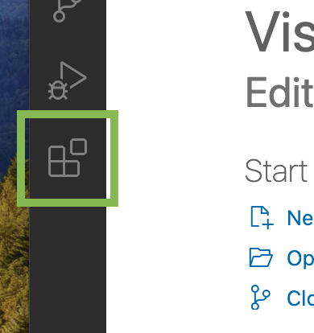

# Instructions on reproducing LLMs

For all of the LLMs below, Visual Studio Code was the code editor of choice. We recommend that this be the code editor used, as all the instructions are written assuming that this is code editor the reader will be using to follow along.

Before jumping into any of the LLMs, make that you have installed the Python extension for Visual Studio Code:
<p align="center">
  
  
</p>


## BioGPT
<bold>Installation</bold>
First, 

``` bash

```

###Running

## LLM2
...

## LLM3
...
