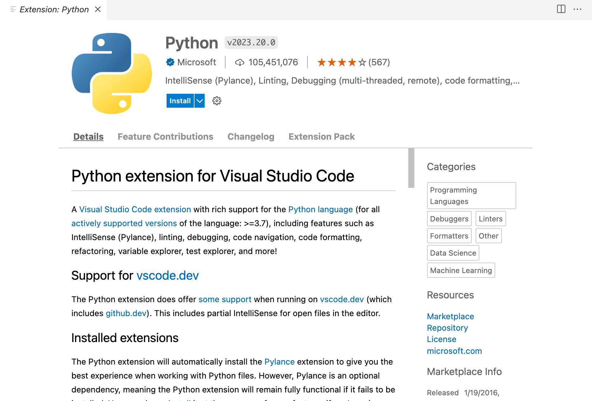

# Instructions on reproducing LLMs

First of all, clone this repository:
``` bash
git clone
cd GROUP-22
```

Now, for or all of the LLMs below, Visual Studio Code was the code editor of choice. We recommend that this be the code editor used, as all the instructions are written assuming that this is code editor the reader will be using to follow along.

Before jumping into any of the LLMs, ensure that the Python extension for Visual Studio Code has been installed:

<p align=center>
  
  
</p>

## BioGPT
<bold>Installation</bold>
First, pip (a package manager) must be installed:

``` bash
python -m ensurepip --upgrade
```

Then install the transformers library, which includes some of the APIs that will be used in the main code.

``` bash
pip install transformers
```

Now, the code for BioGPT is ready to be executed!

``` bash
python biogpt.py
```


###Running

## LLM2
...

## LLM3
...
